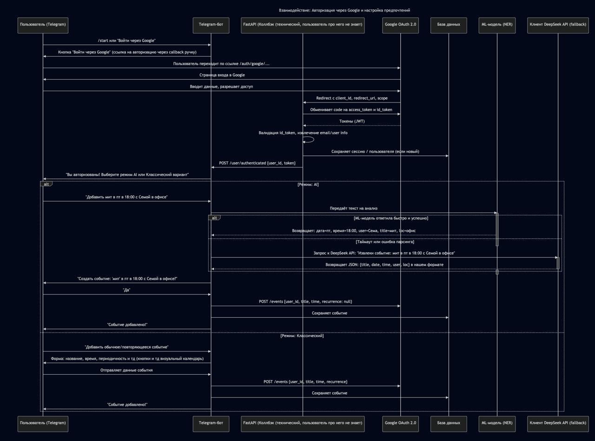
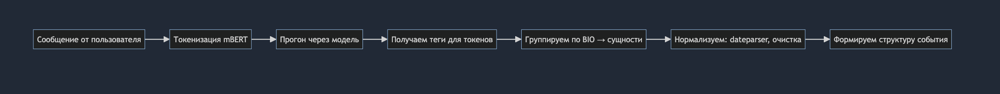

# Бот-организатор

## Что будет видеть пользователь 
Пользователь нажимает на кнопку '/start' и бот предлагает ему авторизоваться. 

Бот скидывает пользователю ссылку в виде кнопки, где он авторизуется в Google-аккаунте.

В свою очередь Google предлагает пользователю разрешит доступ на чтение и запись (rw права) календаря.

Если пользователь соглашается с требованием системы на предоставление доступа к скоупу календаряи ПД пользователя (nickname, email), то бот отправляет сообщение об успешной авторизации.

После бот предлагает пользователю два режима: классическое создание событий и редактирование оных кнопками. А также второй режим, который будет поддерживаться системой - AI. 

## Архитектура проекта


[полная версия](https://mermaid.live/view#pako:eNqtVm1P21YU_iu3_lKQTBIChMQSnWBsU6eyVi3TpCkS8hyXWhibOc60DiFBGGUTXbOifeqHbp32A0xWj_CS8Bfu_Ud7zrEdQgLrNpVI2PE9L8855zlPvKlZfs3WDK1uf92wPctedMzVwFyvegJ_G2YQOpazYXqh-LxuB8KsC_mr7Mkz9Vwe49qWkWrKmL6LsWXbtcl3fNR5wQ_JN7OYkEeyp5qjdkv3lgDHJdulexPyHCneZuE_--jhNZE_Nuvh_IO75JHdjslXBBGfI_WTPBVjBFHtya7sqH3c7chT2ZEnupAXN5QiL9S27Al4xPLP9EbAqisj-DevgfGJ76-6NqFI7-7PN8InopgrjNouLnAfXyLYsYwEKowQuasO1F7VS8xDJ0QMeUgGwJr14UTtAGMbT2JDyJ9lG996gNohO_UM9bUEl7gN4-MMiuxQARH5UlnyBPVHSY0xwqIJap9L71JbMgg074k7dzA5Q-TrIfAjEHraEVUNwBAGPp3RdFUt8Ycj3CkKoL5C7B4yUeJ3uWNeO_gcIBfj7NK_6JpaXwx6W6brfmVaa0Jtq108P1W740OlJAmMmxkMgBwOXKF-d1STKSIG8MQib2Kw-VWOlc_lckmKJPZlwW-41xFz7hkV0E6D0m1WKnteD_EQwPoY-gSRsS447DHD_CGhIxn0eLq78mIITroThnho15zAtkIUIyzXsb1wxanpIkgfrzQCRxd1y9-ws66lroOoXmNvz1OitNPkpB_JkEzLsuv1ldBfsz0inVNL7q9AGsQkf0eNpxRPHYixT79YHh_NfWl8iISgH3UjpXqWQBfMijaOY6IE44uFvW46br5BuuV4j_3hyIsLNCd0bi-ZlGpxPZCHmAbOBMvfpBEtqAwpyVmyXDjCdE7Gh3Pw9jy4_2hZMA7mDlrvWGZo18QmPeMxcBlbWfWDq0Pbgu4MLQBDobbdEnSMsRBxOwRO8EL8Raoh5u9mO4sNPGMJ2LkqgoJroqAUrknLm2AwXez7b1kkA6GS58PSAHy_AM4RASQAtEbnCW3bpDF8nSwbhQIxD_2OWc1O-LinvocpGp6JxmX16S8Bb2ucKlWkXtKAaAKnxPe-NnRTahxfRkn9JzKcrDngCM1a_Zhw1-DVQrxojpDqgo8BULXmGLIuaEJzKepIT3R5LilQF65vzWU1DOPvT-8N5-U86A2KRbMg9c1ExG8nsW7_p259MNiukWFEo83sL1FCRfsbcLA-SD8qiy7rNkmC1QgCehcwhNdw3a3haDcvzkBp_9iPvhVLV0qeM17c3q0Mvu3W7SsUvInD_56YF7yovEaqpV6ABzEve2sYvHY9fPkHbyCoYDD3WHSiRG4G2aNnPyWdVMT3qTKW6OekjMjyNlu0YdzyNU4vuLNtEppM4fs_AVewqtZ7mvX_nfJ7mLNXq3qarq3bAQS7hnfRTTqoapDKdbwPULSaGayR_RbsoKH-o6eepRlh0LB1LfAbq08047EJvuhaY6MGbU3fYjMTvHZ96fv9r6sBpUm9kd4OPvQbXqgZk4XpSbbWjE3tW80olidz06XpYqkwPVsplirlGV17qhmlXGmqMluaLuMyNVmZKW_p2nccv5CrlAuzlUKpUJidKhVnSsWtvwGcVZ1p)

### Классический вариант (взаимодейтсвия с API календарь)

#### Авторизация

Пользователь переходит по ссылке, которую выдает бот, и авторизуется. Мы в свою очередь имеем токены, для того чтобы делать правки на стороне календаря пользователя.

В случае протухания токена мы его перезапрашиваем (заставляем заново авторизовываться).

#### Схема БД (будет правиться или изменяться в моменте разработки)

```sql
-- ===================================
-- Таблица: Пользователи
-- ===================================
CREATE TABLE users (
    id SERIAL PRIMARY KEY,
    telegram_id BIGINT UNIQUE NOT NULL,
    username VARCHAR(255), -- можно не шифровать — публичный в Telegram
    first_name VARCHAR(255),
    last_name VARCHAR(255),

    encrypted_google_email BYTEA NOT NULL,
    encrypted_access_token BYTEA,
    encrypted_refresh_token BYTEA,
    token_expires_at TIMESTAMPTZ,

    is_authorized BOOLEAN DEFAULT FALSE,
    timezone VARCHAR(50) DEFAULT 'UTC',
    
    google_calendar_id VARCHAR(255) DEFAULT 'primary', -- например, primary, work@...

    created_at TIMESTAMPTZ DEFAULT NOW(),
    updated_at TIMESTAMPTZ DEFAULT NOW()
);

-- ===================================
-- Таблица: События (только ссылки!)
-- ===================================
CREATE TABLE user_events (
    id SERIAL PRIMARY KEY,
    user_id INTEGER NOT NULL REFERENCES users(id) ON DELETE CASCADE,

    google_event_id VARCHAR(255) NOT NULL,
    
    created_at TIMESTAMPTZ DEFAULT NOW(),
    updated_at TIMESTAMPTZ DEFAULT NOW(),
);

-- ===================================
-- Таблица: Предпочтения пользователя
-- ===================================
CREATE TABLE user_preferences (
    user_id INTEGER PRIMARY KEY REFERENCES users(id) ON DELETE CASCADE,

    language VARCHAR(5) DEFAULT 'ru',

    ai_fallback_enabled BOOLEAN DEFAULT TRUE,
    ai_timeout_ms INTEGER DEFAULT 3000,

    created_at TIMESTAMPTZ DEFAULT NOW(),
    updated_at TIMESTAMPTZ DEFAULT NOW()
);
```
* В БД храним пользовательские данные в зашифрованном виде
* Храним id созданных событий, но не храним мета-данные по событиям (в целях соблюдения консистентности данных в Google приложении и нашем боте)
* Также храним режимы использования : AI и NoAI по работе с ботом
#### Сценарии использования
* Пользователю предложат два режима
* Если был выбран NoAI вариант, то для выбора даты пользователю будет предложен [UI формат кнопок календаря](https://github.com/noXplode/aiogram_calendar) 
* Пользователю дают серию вопросов для того, чтобы JSON, данными из которого будет сделан запрос в API календаря для создания/редактирования/удаления ноовго или существующего события
* В случае если пользователь ввел сообщение/переслал сообщение из другого чата, то форма скипается и запрос обрабатывает ML-модель, которая потом отправляет собранный JSON на бэкенд, а тот делает запрос в Google календарь API
### AI (mBERT + NER)

Этот режим позволяет пользователю писать события свободным текстом, а боту — автоматически понимать, что именно он хочет создать.

Например:

* «встреча в пт в 18:00 с Семой в офисе»
* «мит завтра в 5 утра в жопе»
* «call with John on friday at 5pm»

**Цель:** Преобразовать сырой текст из сообщения в структурированное событие с полями:

```
{
  "title": "встреча",        // Название события
  "date": "2025-04-25",      // Дата (в формате YYYY-MM-DD)
  "time": "18:00:00",        // Время (в формате HH:MM:SS)
  "loc": "офис",             // Место проведения
  "user": "Сема",            // Участники
  "url": "https://zoom.us/..." // Ссылка (если есть)
}
```

Для этого на нашей стороне, используется многоязычная модель BERT (bert-base-multilingual-cased) и обучаем её как NER-модель (распознавание именованных сущностей).

Для каждого слова (токена) в тексте определить, к какой сущности оно относится.

```
O	Токен не относится ни к одной сущности
B-DATE	Начало даты (например, "в", "пт")
I-DATE	Продолжение даты
B-TIME	Начало времени (например, "18:00", "5 утра")
I-TIME	Продолжение времени
B-LOC	Начало места (например, "в", "офисе")
I-LOC	Продолжение места
B-TITLE	Начало названия события
I-TITLE	Продолжение названия
B-USER	Начало участника (например, "с", "Семой")
I-USER	Продолжение участника
B-URL	Начало ссылки
I-URL	Продолжение ссылки
```

#### Обучение модели

Так как реальных размеченных данных мало, мы генерируем их автоматически по шаблонам.

```
"встреча {date} в {time} в {loc}"
"мит с {user} {date} {time}"
"meeting at {loc} on {date} {time}"
"call with {user} on {date} at {time}"
"{title} {date} в {time} в {loc}"
```
где,

```
date:
  - "завтра"
  - "в пт"
  - "next friday"
  - "on monday"

time:
  - "в 18:30"
  - "5pm"
  - "в 6 утра"

loc:
  - "в офисе"
  - "at the bar"
  - "у метро"

user:
  - "с Семой"
  - "with John"

title:
  - "встреча"
  - "team meeting"

url:
  - "https://zoom.us/..."
```

#### Флоу инференса-модели

1. Модель: `bert-base-multilingual-cased` (Hugging Face)
2. Задача: `Token Classification` (NER)
3. Количество меток: 13 (O + B/I для 6 типов)
4. Оптимизатор: AdamW
5. Learning rate: 2e-5
6. Эпохи: 2–3
7. Batch size: 16
8. Валидация: 10% данных

#### Флоу пользователя:




### AI (DeepSeek API fallback)
На ответ ML модели у нас висит таймер. Таймер нужен для таких случаев как: 
* У нас зависла модель
* Модель не смогла распарсить ответ(в случае если пользователь отправил фигню)

У нас для этого поднят клиент DeepSeek API, который дополнительно провалидирует, или распарсит пользовательский запрос и вернет ответ

# Задачи участников

## Backend

### Босякова Яна

* Поднять Oauth авторизацию сынтегрировать гугл апи и тг бот (5-6 дня)
* Поднять БД (2-3 дня)
* Написать базовую логику для работы с апи календарем + тесты (3-7 дней)
* обернуть приложение в докер + поднять приложение на виртуалке (2-3 дня)

Итог: 17 дней работы

### Быреева Александра

* Поднять DeepSeekApi клиент + написать тесты (3 дня)
* inline-кнопочки для календаря (3-4 дня)
* Написать базовую логику для работы с апи календарем + тесты (3-7 дней)

Итог: 16 дней работы

### Глухов Никита

* Настроить CI/CD для репозитория: прогон тестов + проверка линтера (2-3 дня)
* Тестирование сценариев (3 дня)
* написать промпты для фоллбэчного сценария, если моделька не справилась (4-6 дня)


Итог: 16 дней работы

---

## ML

**Таска1:** обучающие данные

Собрать списки возможных вариантов: даты, времени, мест, людей, названий событий и ссылок.
Собрать файл со всеми этими списками.


**Таска2:** шаблоны


Подготовить 10–15 шаблонов сообщений на русском и английском, разных форматов.
Сделать файл с массивом шаблонов.

**Таска3:**

сгенерировать N примеров (3–10k);
 • для каждого примера сгенерировать токены и BIO-теги;
 • сохранить в формат JSONL.
Выход: generate_dataset.py + файл dataset.jsonl.

**Таска4:**

подготовить данные для обучения модели.
Что сделать:
 • загрузить JSONL;
 • разбить на train/test;
 • сохранить в формат HF Dataset.

**Таска5:**
Составить полный список тегов (O, B-, I-), сделать маппинги ID <=>label и подготовить их для обучения модели.


**Таска6:**
Написать обучение NER на mBERT

Цель: обучить модель извлекать сущности.
Что сделать:
 • использовать HuggingFace Trainer;
 • взять bert-base-multilingual-cased;
 • сделать токенизацию текстов с alignments;
 • запустить обучение на 3 эпохи.

**Таска7:**

По обученной модельки строить пайплайн обучения

Сделать функцию, которая по тексту выдаёт найденные сущности: дата, время, место, название, пользователь, ссылка.
Использовать уже обученную модель, просто подать ей текст и собрать результаты.

**Таска8:**

Привести найденные сущности в удобный вид:
 • дату и время собрать в один нормальный datetime,
 • место почистить от лишних слов,
 • название и пользователя привести к нормальной форме.

**Таска9:**

Сделать пайплайн,  который:
 1. вызывает инференс,
 2. вызывает нормализацию,
 3. возвращает готовое структурированное событие в виде JSON.

**Таска10:**

интеграция с ботом

### Гузь Даниил

* Подготовить данные для обучения NER модели
* Инференс-модели и все последующие задачи по ML

### Кривова Милана
* Подготовить данные для обучения NER модели
* Инференс-модели и все последующие задачи по ML